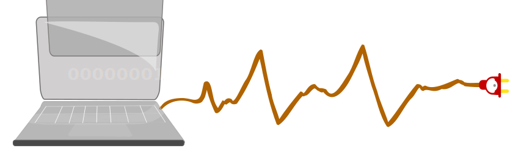

---

title: Страница Буки
# permalink: b
description: Страница настроек и тестирования

---

<nav id="navi"><!-- js --></nav>

# Буки

###### DOCUMENTATION

**Буки** – это вторая буква. Эта буква не имеет числового значения, то есть ее состояние равно `undefined` (неопределено). Таким образом записи под маркировкой с этой буквой не входят в последовательность стека записей и будут иметь свободный статус правил и тп.

<!--TODO: - [ ] cтатус группы -->

**Соглашения и обязательства**
---

Именование объектов:

**ДОКУМЕНТАЦИЯ**
---
    
1. Названия страниц документации распределяются на группы префиксами-названиями букв церковно-славянского алфавита.
2. Под префиксом буквы `buki-` страницы не связанные контекстом и продолжением, и ссылками. На этих страницах не должно быть ссылок. Ссылка допускается только на общую навигацию.

 

<!--ystm_start-->
 

 |||| 
 |:---|:---:|---:| 
 [← назад](buki-set.md)|[ 🔝 ](#)|[далее →](dobro-day.md) 

  
<!--ystm_end-->
