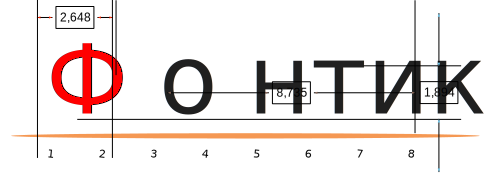

---

title: Шрифт самодельный Fontics
description: Пример шрифта Фонтикс

---

<nav id="navi"><!-- js --></nav>

# О шрифте

	FONTS

Шрифт является графическим отображением звуков исходящих из уст человека умеющего извлекать эти звуки.

[Пример шрифтов здесь…](https://fonts.a374.ru/)

Прежде произнесения осмысленных звукосочетаний проходит многодневное подготовление данного процесса.

Графичесское представление звуков на данном сайте имеет основанием церковно-славянское слово. Таким образом, гарнитура подготовлена по образу и поддобию церковно-славянского шрифта адаптированного под русское письмо. Имеет ограничения в диакритике, но имеет основные знаки для уточнения, например:

### Мно§гие не понима§ютъ, что а^ и а$ э§то ра§зные ца§рства. А€ вы§ понима§ете о$ че§мъ иде§тъ ре§чь?

Таким образом можно объяснять (письменно) многие понятия не отрываясь от `русского` письма.

 

|<--------——|••••••|——-------->|
|:---|:---:|---:|
[…назад](dobro-django.md)|[вверх](#)|[далее…](glagol-git.md)

 

