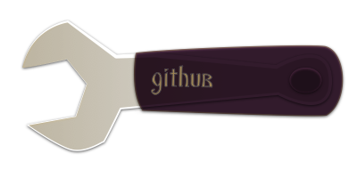

<div class="navi"><nav id="navi"><!-- js --></nav></div>

# GIT управление снаружи и внутри

<span id="buki-bookmarks-img" class="img" onclick="imgResize(55)"></span>

### Глобальный `.gitignore`

Очень много сохраните рабочего времени, если с самого начала будете использовать **глобальный файл** игнорирования директорий и файлов в системе контроля версий `GIT`. В этом файле должны храниться все ненужные для публикации материалы для всех языков программирования. 

1. Создайте файл с именем `.gitignore_global` и положите его в домашней папке пользователя.
2. Проверте его командой в терминале:
```sh
git config --get core.excludesfile
```
1. Если что-то не так, то просто установите наш файл в качестве глобального.
```sh
git config --global core.excludesFile ~/.gitignore_global
```
<details>
<summary>Пример файла</summary>

```sh
# ГЛОБАЛЬНЫЙ ИГНОРИК
# ==================


# ********************
#  ---- folders -----
# ********************

*-GITOFF/
000/
.myname/
/ystm
rrr/
RRR/
XXX/
*-xxx/
xxx/
node_modules/
test-*/
task*/

# python
bin/
include/
lib/
*.pyc

# ********************
#  ---- files -----
# ********************

!000.jpeg
!000.jpg

.DS_Store
*OFFGIT.*
*GITOFF.*
Icon?
Icon
000.*
*-off.*
*-xxx.*
*-XXX.*
*-test.*
*.zip
*.pxm
*.art
*.rtf
*.rtdf
*.pdf
*.workflow
*.key
*.pages
*.band
*.glyphs
test.*
*.vscode
*.ystm
*.workflow

*.*~

# =-=-=-=-=-=-=-=-=-=- REGEXP

# Swap
[._]*.s[a-v][a-z]
!*.svg  # comment out if you don't need vector files
[._]*.sw[a-p]
[._]s[a-rt-v][a-z]
[._]ss[a-gi-z]
[._]sw[a-p]

# Session
Session.vim
Sessionx.vim

# Temporary
.netrwhist
*~
# Auto-generated tag files
tags
# Persistent undo
[._]*.un~

# Должен присутствовать всегда (should be)
!000.png
```
</details>

Пример такого файла [здесь…](../external/gitignore_global.txt)

<span style="color: #e34234;">ВАЖНО</span> сразу укажите имена личных своих папок, файлов или префиксов (постфиксов) и далее спокойно используйте их в любых проектах для тестирования, отключения и тд… Это очень удобно. Такие файлы никогда не попадут в публичный доступ. 


### ЛОКАЛЬНАЯ СИНХРОНИЗАЦИЯ

При разработке какого-нибудь проекта, важно понимать, в случае если используются два 
компьютера и более в одном помещении, и в этом проекте используется контроль версий `GIT` или иная, 
тогда отправка материалов должна производиться только с одного компьютера. 
Сами же материалы Синхронизируются в той системе в которой вы работаете.

Просто вытаскиваем проект на рабочий стол и синхроно продуктивим с разных точек.

Такой способ работы востребован в здании с несколькими этажами, между которыми затруднительно перемещение рабочей машины (компьютера).

### <span style="color:#e34234">ПРОБЛЕМЫ ОТПРАВКИ</span> (`push problem`) в `VSCode`

1. **`VSCode` не отправляет коммиты** – такое поведение связано с настройкой ключей. Если вы добавили ключи и у вас не получается отправить коммиты на сервер, это значит, что `VSCode` не может читать приватный ключ доступа. Сначала попробуйте отправить изменнения через терминал командой `git push`, где вам предложат ввести пароль доступа. Если отправить получилось, тогда введите в терминале команду:

```sh
ssh-add -K ~/.ssh/id_rsa   # где `id_rsa` замените на имя файла приватного ключа 
```

После выполнения команды `VSCode` должен начать отправлять все изменения исправно.

<br>

[…на главную](/)

<br>

<script src="assets/js/navi.js"></script>

