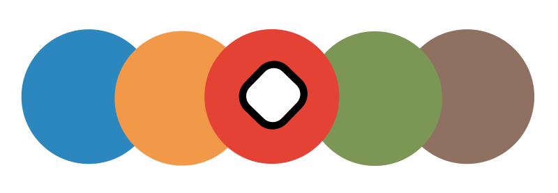

<nav id="navi"><!-- js --></nav>

# Цвéточная схема для web a374

Основные цвета используемые в проекте и палитре
---

    .blue-a374 { color: #2C87BF; }
    .green-a374 { color: #7C9655; }
    .orange-a374 { color: #F29849; }
    .red-a374 { color: #E34234; }
    .braun-a374 { color: #8F7161; }

Цвета подобраны с учетом видимости для контрастности черного и белого цветов. 
Нет строгого деления и предписания по использованию раскрасок материалов.

 

<!--ystm_start-->
 

 |||| 
 |:---|:---:|---:| 
 [← назад](kakw-cal.md)|[ 🔝 ](#)|[далее →](nash-ncal.md) 

  
<!--ystm_end-->
