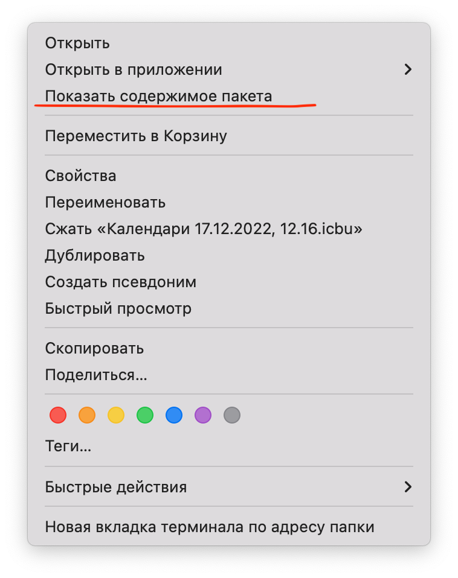

---

title: Системный календарь
description: Об необходимых действиях с системным календарем

---

<nav id="navi"><!-- js --></nav>

# Редактирование календаря

	Calendar Apple

Иногда возникает путаница и непонятки при работе с системным календарем на компьютерах `Mac`.

## Первое

Если вы решили что-то сделать со своим системным календарем и данными добавленными в него, сначала выполните два действия.

1. Сделайте полный архив календаря вашего Мак.
2. Сделайте экспорт выбранного календаря.

   

## Второе

Теперь вы можете спокойно изменять и востанавливать свои календари и поэксперементировать. Главный файл календаря (приоритет) находится на сервере  `iCloud.com` и имено там в настройках востанавливается версия утраченного календаря:

Cмотри веб-аккаунт [icloud.com](https://icloud.com)

Иногда календарь не хочет востанавливаться и ведет себя непонятно, скидываю загружаемую вами версию и возвращая все календари в исходный вид. Так настроен сервер icloud сохранности данных пользователей.

---

## Архив

Архивированный файл `rrr.icbu` календаря содержит все данные включая файлы приложенные к календарю. Данные не пропадут, они находятся в **пакете** архива. Так проще всего иметь доступ к календарным ресурсам если что-то пойдет не так.

	Справка: 
	чтобы просмотреть файлы скрытого пакета выберите в меню файла:  Показать содержимое пакета:

Второй файл "**экспорта**" с расширение `.ics` проще, он содержит только тектовые данные, а все остальное будет подгружено с сервера `icloud` если вы захотите его востановить. В этом файле можно аккуратно редактировать данные (кроме ссылок!!!) и позже загружать в новый календарь (новое событие) или добавлять в уже имеющийся календарь.

## Принцип работы

Удаляйте старый ненужный календарь в самую последнюю очередь на своем мак, только когда будет закончен новый вариант. 

Выполните *экспорт* календаря, потом измените этот файл, если требуется такое, потом импортируйте отредактированный вариант как **новое событие**, добавив его в календари раздела `iclod` и только потом можете спокойно удалить ненужную старую версию.

Помните о бекапе хранящимся на сервере Apple icloud.com

 

[…назад](kakw-colors.md):---|---:[далее…](pokoy-proval.md)

 

