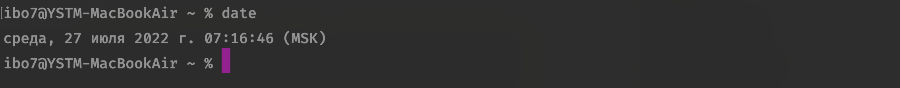

---

title: Документация по SHELL
description: Документация по SHELL

---

<nav id="navi"><!-- js --></nav>

# Немного о  SHELL

	Mac OS

[Документация здесь…](https://developer.apple.com/library/archive/documentation/OpenSource/Conceptual/ShellScripting/BeforeYouBegin/BeforeYouBegin.html#//apple_ref/doc/uid/TP40004268-CH1-SW1)

 

[…назад](slovo-server.md):---|---:[далее…](tako-type.md)

 

