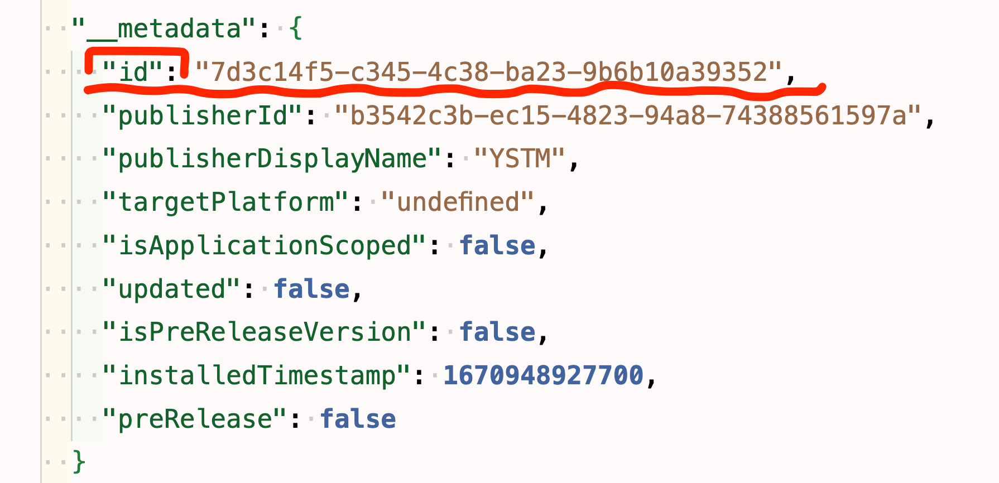

<div class="navi"><nav id="navi"><!-- js --></nav></div>

# Тема для VSCode

<span id="comp-start-img" class="img" onclick="imgResize()"></span>

	Editor, Marketplace VSCode

## Создание расширения

Справка [здесь](https://code.visualstudio.com/api).

Речь идет о расширении для редактора кода `Visual Studio Code`, а точнее про создание и публикации темы в `Marketplace` для дальнейшего удобного пользования этой темой в редакторе. 

## Редакция темы

В дальнейшем нам потребуется редактировать наше расширение (тему) и здесь дано описание того, как это лучше делать.

### <span style="color: #f00;">**Тонкости публикации**:

**До того как вы в первый раз захотите публиковать свое тествое расширение в маркетплэйс**, нужно знать кое-что.<span style="color: #e34234;"> В маркете ваше созданное расширение нельзя будет удалить</span>, а только версионо изменять. Еще **Marketplace** настроен таким образом, что по незнанию туда можно опубликовать много разных вариантов одной и тойже версии продукта, если вы заново станете создавать не понравившийся вам ПАКЕТ. Например при генерации проекта вы назвали свой продукт (расширение) `SuperExt`, и это название прописывается в пакете вашего расширения в файле `package.json`  так: 

```json
"name":"SuperExt",
```

и далее опубликовали свое расширение в магазине приложений. Это значит, что там появится **неудалямый** экземпляр вашего приложения. 

Всё!!! На этом месте стоп. Если вы удалите локально и заново создадите ПАКЕТ с таким же именем,то магазин создаст второй **неудаляемый** экземпляр вашего расшрения с новым `ID`. Следите за `ID` вашего приложения в файле настроек пакета `package.json`:



ВЫВОД ТАКОВ: <span style="color: #e34234;">Тщательно продумайте свое именование продукта и только после этого публикуйте свой **ОДИН** пакет **одного** расширения с одним и тем же `ID`.

Пример одного приложения и трех случайно созданных неудаляемых пакетов [здесь…]()

Если вы будете пользоваться только версионностью одного этого ПАКЕТА, то магазин будет создавать только версии *одного* вашего продукта и пользователи будут довольны правильным предложением расширения на витрине и в редакторе кода. В противном случае, при поиске вашего товара (расширения), поиск будет выдавать все правильные и неправильные, но уже опубликованные варианты ваших приложений. С уборкой в `VisualStudio Marketplace` пока не все удобно!

## Как редакторовать и что?

Тема редактируется в файле `themes/youreName.json` прямым редактированием. 
Вам нужно провести редактирование темы каким нибудь способом указаным в [инструкции](https://code.visualstudio.com/api/extension-guides/color-theme) производителя продукта или другим известным вам способом. Далее просто скопировать настройки в файл темы. 

Далее просто публикуете с новым номером  версией или любым предыдущим, если нужно что то откорректировать в уже опубликованных версиях. И помните про **`ID`**. 


<br>

[…на главную](/)

<br>

<span id="comp-end-img" class="img" onclick="imgResize()"></span>


<script src="assets/js/navi.js"></script>