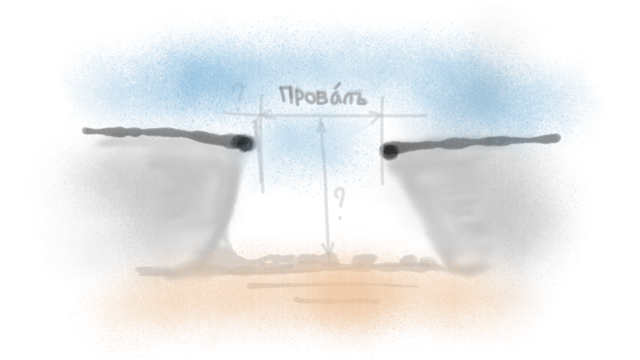

 <nav id="navi"> <!-- js --> </nav>

# Задержка мысли

Задержки запинки, затыкания и тд.
---

**Задержка мысли** (запинка) – неспособность получить помощи от сознания в текущий момент, миг времени. Совокупность задержек дает провал в производстве умом слова, тем самым инициирую процесc переключения на другую область сознания обрывая таким образом выполнение предыдущего процесса (решения задачи). 
В просто речии: – ушел в другую область.

В момент задержки требуется не пониковать, а выполнить зарисовку провала любым удобным подручным способом. Тем саммым зафиксировав точку проблемы. Нельзя оставлять этот процесс неосознаным… Рисуем провал…

 

r>

[…на главную](/)

 

